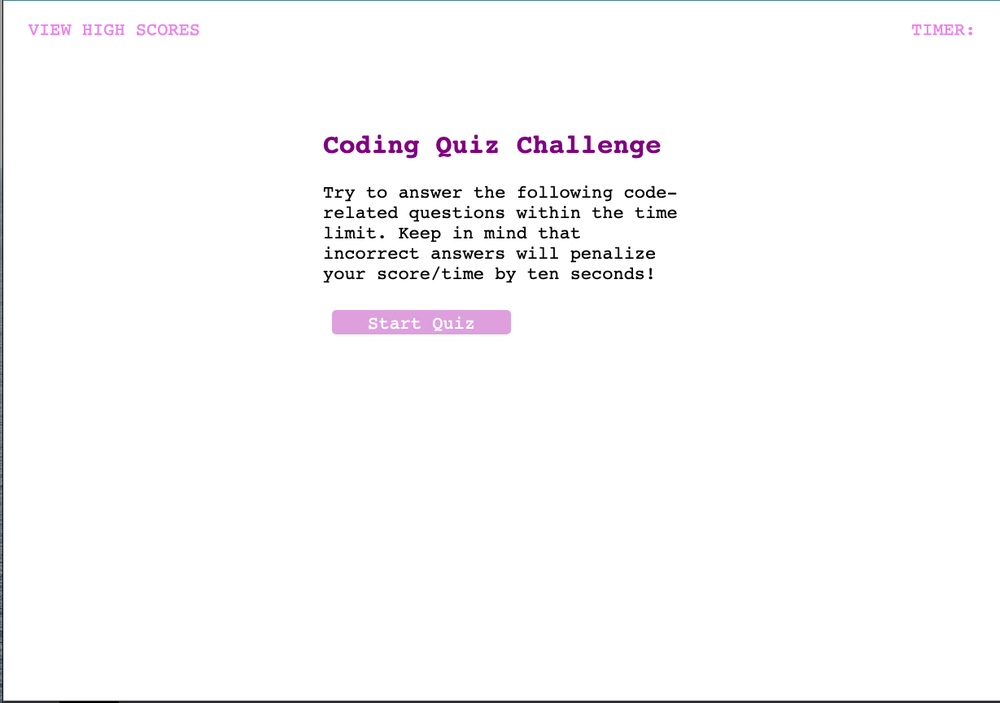

# coding-quiz
Module-4 Timed Quiz Project
## Description

The purpose of this project is to help prepare for technical interview questions by building a timed quiz application. The quiz covers different subjects such as HTML, CSS, and JavaScript. It not only tests your knowledge of these topics but also gives you the opportunity to practice building a quiz application.

## Table of Contents 

- [Usage](#usage)
- [Credits](#credits)
- [License](#license)

## Usage

-Open the quiz application in a web browser.
-Click the "Start Quiz" button to begin the quiz.
-Read each question carefully and select the correct answer.
-Once all questions have been answered or the time limit has been reached, the quiz ends.
-View your final score and enter your initials.
-Click the "Submit" button to save your score.

https://hexd9.github.io/coding-quiz/

## Credits

-Shawn Littrel (Teacher Aide)
-Ruben Ruiz (Bootcamp colleague)
-JavaScript HTML DOM EventListener: https://www.w3schools.com/js/js_htmldom_eventlistener.asp
-JavaScript - HTML DOM Methods: https://www.w3schools.com/js/js_htmldom_methods.asp
-Function expression: https://developer.mozilla.org/en-US/docs/Web/JavaScript/Reference/Operators/function
-Loops and iteration: https://developer.mozilla.org/en-US/docs/Web/JavaScript/Guide/Loops_and_iteration

## License

MIT License

Copyright (c) [2023] [HectorDelgado]

Permission is hereby granted, free of charge, to any person obtaining a copy of this software and associated documentation files (the "Software"), to deal in the Software without restriction, including without limitation the rights to use, copy, modify, merge, publish, distribute, sublicense, and/or sell copies of the Software, and to permit persons to whom the Software is furnished to do so, subject to the following conditions:

The above copyright notice and this permission notice shall be included in all copies or substantial portions of the Software.

THE SOFTWARE IS PROVIDED "AS IS", WITHOUT WARRANTY OF ANY KIND, EXPRESS OR IMPLIED, INCLUDING BUT NOT LIMITED TO THE WARRANTIES OF MERCHANTABILITY, FITNESS FOR A PARTICULAR PURPOSE AND NONINFRINGEMENT. IN NO EVENT SHALL THE AUTHORS OR COPYRIGHT HOLDERS BE LIABLE FOR ANY CLAIM, DAMAGES OR OTHER LIABILITY, WHETHER IN AN ACTION OF CONTRACT, TORT OR OTHERWISE, ARISING FROM, OUT OF OR IN CONNECTION WITH THE SOFTWARE OR THE USE OR OTHER DEALINGS IN THE SOFTWARE.

## Badges

